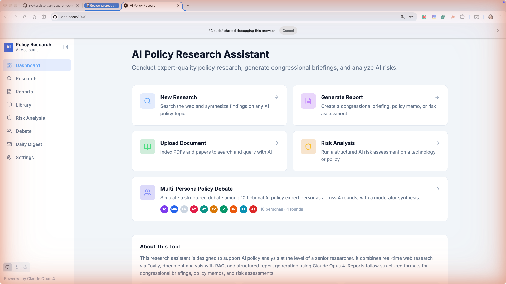
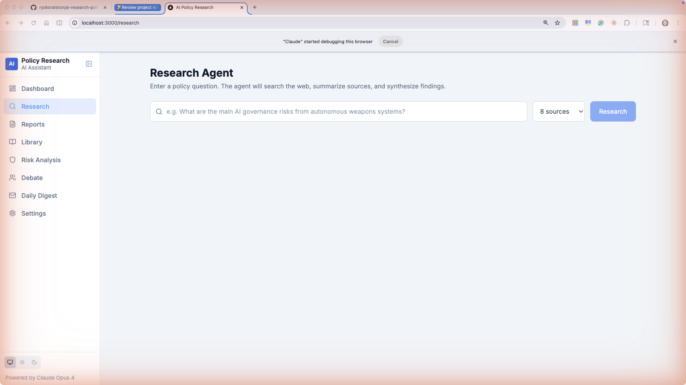
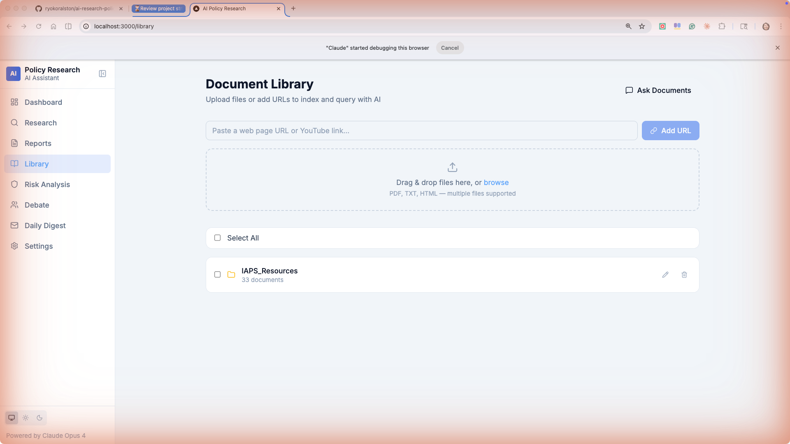
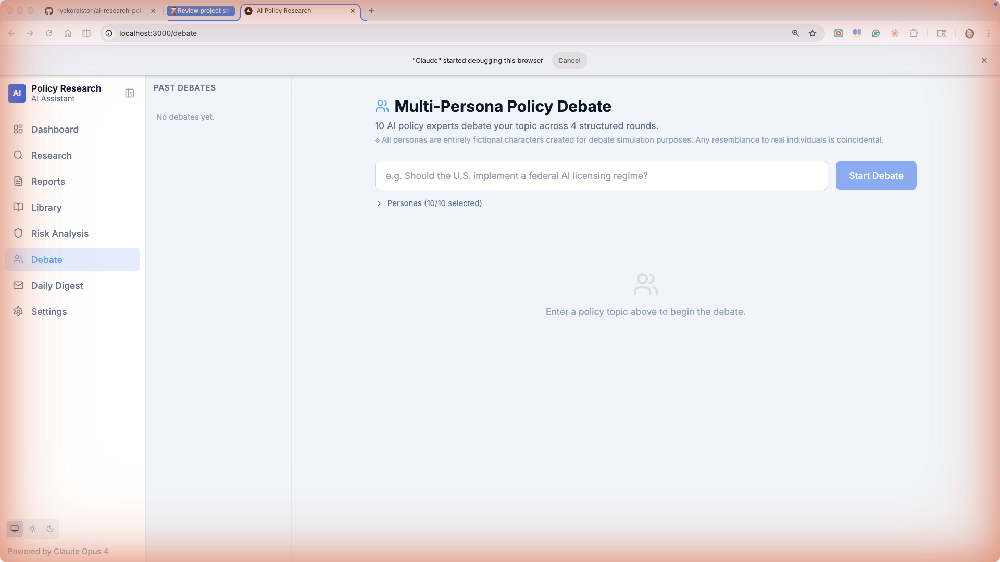

# AI Policy Research Assistant

A web application for AI policy research, powered by Claude (Anthropic) and Tavily. Research, analyze, and generate reports — all in one place.

## Screenshots

| Dashboard | Research Agent |
|---|---|
|  |  |

| Document Library | Multi-Persona Debate |
|---|---|
|  |  |

## Features

- **Research** — Automatically decomposes queries into sub-searches, runs parallel web searches via Tavily, and synthesizes results with Claude (streaming output)
- **Document Library** — Upload PDFs, web pages, and YouTube transcripts to build a searchable knowledge base backed by ChromaDB (RAG)
- **Analysis** — Generate in-depth analysis grounded in your document library, streamed in real time
- **AI Policy Debate** — Simulate a multi-persona debate (e.g. pro-regulation vs. tech-optimist) on any AI policy topic
- **Reports** — Generate PDF reports from three templates: Congressional Brief, Policy Memo, and Risk Assessment
- **Daily Digest** — Receive a daily email summarizing the latest developments on topics you define (optional)
- **Settings** — Configure models (claude-opus-4-6 / claude-haiku) and API keys from the browser

## Tech Stack

| Layer | Technology |
|---|---|
| Frontend | Next.js 14 · TypeScript · Tailwind CSS |
| Backend | FastAPI · Python 3.12 |
| AI | Anthropic Claude API (claude-opus-4-6 / claude-haiku-4-5) |
| Web Search | Tavily API |
| Vector DB | ChromaDB + sentence-transformers |
| Database | SQLite (SQLAlchemy) |
| Scheduler | APScheduler |

## Getting Started

### Prerequisites

- Python 3.11+
- Node.js 18+
- [Anthropic API key](https://console.anthropic.com)
- [Tavily API key](https://app.tavily.com) (free tier: 1,000 requests/month)

### Installation

```bash
# 1. Clone the repository
git clone https://github.com/ryokoralston/ai-research-policy-app.git
cd ai-research-policy-app

# 2. Set up environment variables
cp backend/.env.example backend/.env
# Open backend/.env and add your API keys

# 3. Install backend dependencies
cd backend
python -m venv venv
source venv/bin/activate   # Windows: venv\Scripts\activate
pip install -r requirements.txt
cd ..

# 4. Install frontend dependencies
cd frontend
npm install
cd ..
```

### Running

```bash
./start.sh
```

- Frontend: http://localhost:3000
- Backend API docs: http://localhost:8000/docs

Or start each server individually:

```bash
# Backend
cd backend && source venv/bin/activate
uvicorn main:app --reload --port 8000

# Frontend (separate terminal)
cd frontend && npm run dev
```

To stop all servers:

```bash
./stop.sh
```

## Environment Variables

Copy `backend/.env.example` to `backend/.env` and fill in the values below.

| Variable | Description | Required |
|---|---|---|
| `ANTHROPIC_API_KEY` | Anthropic API key | ✅ |
| `TAVILY_API_KEY` | Tavily search API key | ✅ |
| `CLAUDE_MODEL` | Main model (default: `claude-opus-4-6`) | |
| `CLAUDE_FAST_MODEL` | Fast model (default: `claude-haiku-4-5-20251001`) | |
| `CORS_ORIGINS` | Frontend URL (default: `http://localhost:3000`) | |
| `DIGEST_EMAIL_TO` | Recipient address for daily digest | |
| `DIGEST_EMAIL_FROM` | Gmail address to send from | |
| `DIGEST_SMTP_PASSWORD` | Gmail app password | |
| `DIGEST_TOPICS` | Comma-separated topics to monitor | |

> To generate a Gmail app password, go to **Google Account → Security → 2-Step Verification → App passwords**.

## License

MIT
